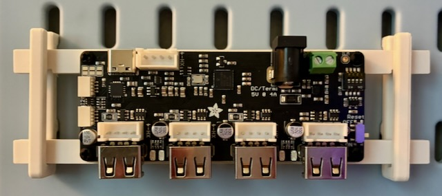
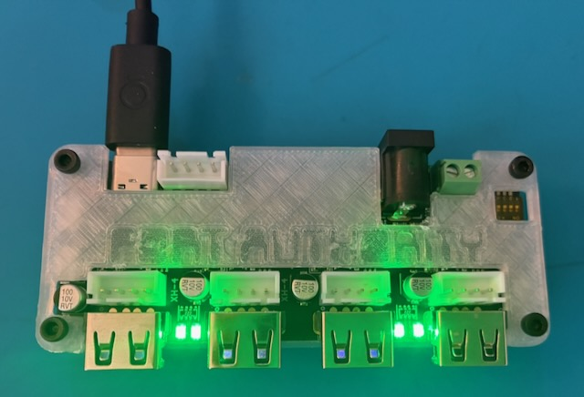
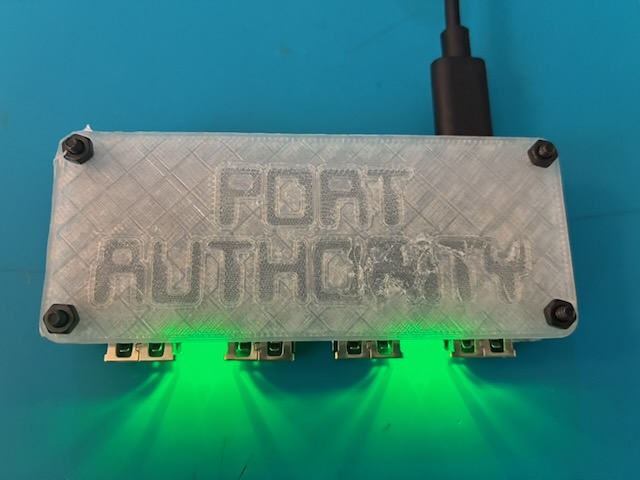

# Port Authority Cases

3D printable cases for the Adafruit Port Authority 4-port HIL hub.

Both designs are parametric FreeCAD files. Open the `.FCStd`, edit the `Params`
spreadsheet, and recompute. `build_case.py` regenerates each model from scratch.

## SKADIS

Skeleton frame that hangs on stock IKEA SKADIS hooks. The hub screws into
M2.5 heat-set inserts on the rails.

## Sandwich

Top and bottom plates that screw together through the hub's mount holes with
M2.5 screws and nuts. No spacers needed.

## License

MIT
